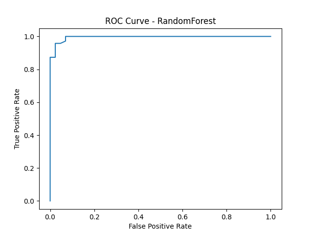
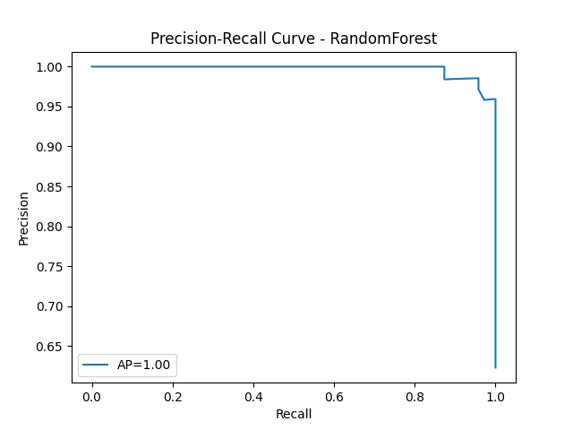
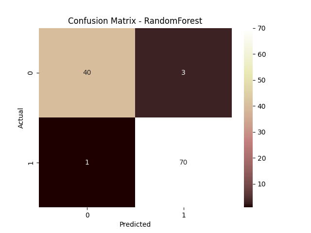

# Model Card: RandomForest

## Overview
- **Task**: Binary Classification
- **Dataset**: Breast Cancer (sklearn)
- **Train/Test Split**: 80/20
- **Evaluation Date**: 2025-09-05 11:49:38

## Metrics
- **Accuracy**: 0.9649
- **F1**: 0.9722
- **AUC**: 0.9953
- **RMSE**: 0.1640
- **MAE**: 0.0682

## Plots
Hover over link to view plots
- ROC Curve  
  

- Precision-Recall Curve  
  

- Confusion Matrix  
  

## Strengths
- Handles binary classification effectively.
- Useful for medical datasets.

## Limitations
- May not generalize to non-binary tasks.
- Performance may vary on imbalanced datasets.

## Intended Use
- Educational / demonstration purposes.
- Should **not** be used for medical decisions.

## Notes
- RMSE/MAE computed on predicted probabilities.
- Educational purpose only.
